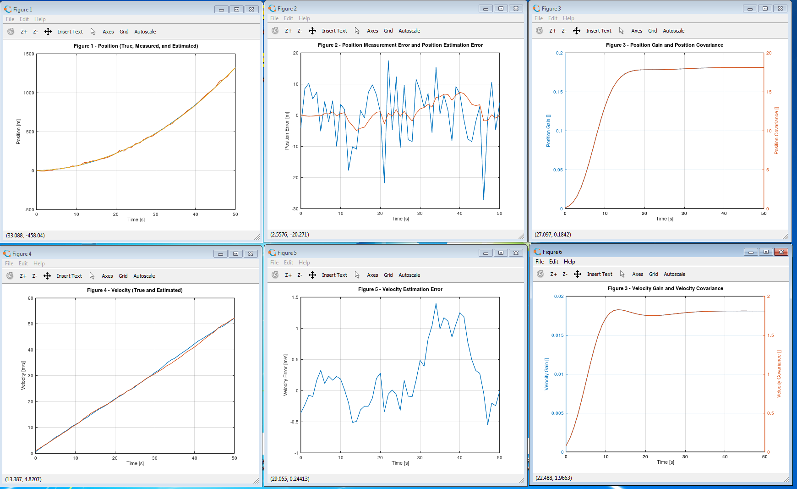

# kalman-estimator - a Kalman estimator in C++

**Contents**  

- [Example usage](#example-usage)
- [In a nutshell](#in-a-nutshell)
- [Basic Kalman estimator code](#basic-kalman-estimator-code)
- [Developing and testing the software](#developing-and-testing-the-software)  
- [Notes and references](#notes-and-references)

<!-- 
- [License](#license)
- [Dependencies](#dependencies)
- [Installation](#installation)
- [Synopsis](#synopsis)
- [Features](#features)
- [Reported to work with](#reported-to-work-with)
- [Building the tests](#building-the-tests)
- [Other implementations of any](#other-implementations-of-any)
- [Appendix](#appendix) -->


Example usage
-------------

```C++
// Prepare variables...

// Create Kalman estimator:

kalman estim(
    dt          // time step
    , A         // system dynamics matrix: state-k-1 => state-k
    , B         // control input matrix: control => state
    , H         // measurement output matrix: state => measurement
    , Q         // process noise covariance
    , R         // measurement noise covariance
    , P         // initial estimate error covariance
    , xhat      // initial system state estimate
);

// Use the estimator, feed it a constant acceleration, system noise and a noisy measurement:

for ( int i = 0; i*dt < T; ++i )
{
    // Use a constant commanded acceleration of 1 [m/s^2]:
    const kalman::u_t u = {1};

    // Simulate the linear system:
    x = A * x + B * u + process_noise( dt, accelnoise );

    // Simulate the noisy measurement:
    auto z = H * x + meas_noise( measnoise );

    // Process a time-step:
    estim.update( u, z );
}
```


In a nutshell
-------------
Try and gain familiarity with the Kalman estimator. The intention is to implement a control system using a Kalman estimator in C++ on a small computer board like the [Adafruit Pro Trinket](https://www.adafruit.com/products/2010) and control the positioning of a spring&ndash;mass system with it.  

Plan:
- [x] Create a [simulation program in Matlab](example/matlab/kalman-sim.m) with a basic [Kalman Estimator](example/matlab/kalman.m). 
- [x] Translate Matlab code to [C++ program](example/kalman-sim.cpp) and [estimator](include/num/kalman.hpp) using a recent [C++ standard (C++14, C++17)](https://isocpp.org/). 
- [x] Write a supporting [matrix library](include/num/matrix.hpp).
- [ ] Write a supporting [fixed-point library](include/num/fixed-point.hpp).
- [ ] Design a simple setup to control via an [Adafruit Pro Trinket](https://www.adafruit.com/products/2010) (Arduino-like) board (spring&ndash;mass positioning).
- [ ] Install up-to-date version of the [Arduino IDE](https://www.arduino.cc/en/Main/Software).
- [ ] Update Arduino compiler proper to recent version of [AVR GCC](http://blog.zakkemble.co.uk/avr-gcc-builds/).
- [ ] Create a demo application for the setup that implements a conventional [PID controller](https://en.wikipedia.org/wiki/PID_controller).
- [ ] Create a demo application for the setup that implements a controller that uses the Kalman estimator.
- [ ] To reduce the computational load, implement (automatic) transitioning to a fixed Kalman gain after it has stabilized.
- [ ] Time free-running loop on Trinket board, varing floating/fixed point, updating/fixed Kalman gain and optimizations, see table 1. below.
- [ ] Asses possible bottlenecks in the C++ code that may be easy to avoid.
- [ ] ...


Performance | Type                    | Kalman gain | Optimization | Relative time |
------------|-------------------------|-------------|--------------|---------------|
&nbsp;      | double                  | updating    | -O2          | &nbsp;|
&nbsp;      | double                  | updating    | -Os          | &nbsp;|
&nbsp;      | fixed_point&lt;int32_t> | updating    | -O2          | &nbsp;|
&nbsp;      | fixed_point&lt;int32_t> | updating    | -Os          | &nbsp;|
&nbsp;      | double                  | fix on %chg | -O2          | &nbsp;|
&nbsp;      | double                  | fix on %chg | -Os          | &nbsp;|
&nbsp;      | fixed_point&lt;int32_t> | fix on %chg | -O2          | &nbsp;|
&nbsp;      | fixed_point&lt;int32_t> | fix on %chg | -Os          | &nbsp;|

Table 1. Relative performance for numeric type, fixing Kalman gain and compiler optimization.


Basic Kalman estimator code
---------------------------

```C++
void update( u_t const & u, z_t const & z )
{
	// --------------------------------------
	// 1. Predict (time update)
	
	// 1a: Project the state ahead:
	xhat = A * xhat + B * u;
	
	// 1b: Project the error covariance ahead:
	P = A * P * transposed(A) + Q;
	
	// --------------------------------------
	// 2. Correct (measurement update)
	
	// 2a: Compute the Kalman gain:
	K = P * transposed(H) * inverted(H * P * transposed(H) + R);
	
	// 2b: Update estimate with measurement:
	xhat = xhat + K * (z - H * xhat);
	
	// 2c: Update the error covariance:
	P = (I() - K * H) * P;
}
```
  


Graph for a simulation run with the resulting (estimated) position, (estimated) velocity, errors and Kalman gains.


Developing and testing the software
------------------------------------
The software is developed using both the Arduino IDE and a separate [C++17](https://en.wikipedia.org/wiki/C%2B%2B17) compiler on a personal computer. The software is developed and tested as a PC program using the [*lest* test framework](https://github.com/martinmoene/lest). The Arduino IDE is used to verify that what we develop as a C++ program is acceptable as an Arduino program. The IDE is also used to upload the program to the Pro Trinket.

### Prerequisites
In what follows, it is expected that the [Arduino IDE](https://www.arduino.cc/en/Main/Software) with updated [AVR GCC](http://blog.zakkemble.co.uk/avr-gcc-builds/) is available. If you want to compile and run the tests, a C++17 compiler such as [GNU C++](https://gcc.gnu.org/) or [Visual C++ 2017](https://www.visualstudio.com/) is needed. 

### Setup Arduino IDE for Pro Trinket
To be able to compile programs for the Pro Trinket board and to upload the result to it via [USB](https://en.wikipedia.org/wiki/USB), several settings must be made in the Arduino IDE. This is described in [Setup Arduino IDE for Pro Trinket](doc/Setup-Arduino-IDE-for-Pro-Trinket.md#top).

(to be continued.)


Notes and References
--------------------

**Contents**

- [Kalman Estimator](#kalman-estimator)
- [Matlab](#matlab)
- [C++](#c++)
- [GNUC](#gnuc)
- [AVR](#avr)
- [Arduino](#arduino)
- [Atmel](#atmel)
- [Adafruit](#adafruit)

### Kalman Estimator

Various articles, video's, books to read up on the Kalman estimator.
 
[1] Wikipedia. [Kalman filter](https://en.wikipedia.org/wiki/Kalman_filter).  
[2] Greg Welch and Gary Bishop. [An Introduction to the Kalman Filter](www.cs.unc.edu/~welch/media/pdf/kalman_intro.pdf) (PDF).  
[3] Greg Welch. [Page on The Kalman Filter](http://www.cs.unc.edu/~welch/kalman/).  
[4] Simon D. Levy. [The Extended Kalman Filter: An Interactive Tutorial for Non-Experts](http://home.wlu.edu/~levys/kalman_tutorial/).  
[5] Bilgin Esme. [Kalman Filter For Dummies - A mathematically challenged man's search for scientific wisdom](http://bilgin.esme.org/BitsAndBytes/KalmanFilterforDummies).  
[6] Mayitzin. [Kalman Filter – A painless approach](https://mayitzin.com/2015/06/04/kalman-filter-a-painless-approach/).  
[7] Tucker McClure. How Kalman Filters Work, [part 1](http://www.anuncommonlab.com/articles/how-kalman-filters-work/), [part 2](http://www.anuncommonlab.com/articles/how-kalman-filters-work/part2.html), [part 3](http://www.anuncommonlab.com/articles/how-kalman-filters-work/part3.html) ([Code on MathWorks](https://www.mathworks.com/matlabcentral/fileexchange/56652-particle--sigma-point--and-kalman-filters)).  
[8] Tucker McClure. [How Simulations Work](http://www.anuncommonlab.com/articles/how-simulations-work/).  
[9] Demofox. [Incremental Least Squares Curve Fitting](https://blog.demofox.org/2016/12/22/incremental-least-squares-curve-fitting/) (Contains C++ code).  
[10]  Kristian Sloth Lauszus. [A practical approach to Kalman filter and how to implement it](http://blog.tkjelectronics.dk/2012/09/a-practical-approach-to-kalman-filter-and-how-to-implement-it/) (Contains C code).    
[11] Dan Simon. [Optimal State Estimation: Kalman, H-infinity, and Nonlinear Approaches](http://academic.csuohio.edu/simond/estimation/) ([Code from the book]()).  
[12] iLectureOnline. [Lectures in The Kalman Filter](http://www.ilectureonline.com/lectures/subject/SPECIAL%20TOPICS/26) (42 videos of 6 minutes).  

### Matlab
[13] MathWorks. [MATLAB for Deep Learning](https://nl.mathworks.com/).  
[14] GNU. [GNU Octave - Scientific Programming Language](https://www.gnu.org/software/octave/) (largely compatible with Matlab).  

### C++
[15] ISOCPP. [Standard C++ Foundation](https://isocpp.org/).  
[16] CppReference. [The complete online reference for the C and C++ languages and standard libraries](https://en.cppreference.com/w/cpp).  
[17] Martin Moene. [*lest* test framework](https://github.com/martinmoene/lest).  

### GNUC
[18] GNUC. [GNUC AVR Options](https://gcc.gnu.org/onlinedocs/gcc/AVR-Options.html).  
[19] AVR-GCC. [AVR-GCC 8.1.0 for Windows 32 and 64 bit](http://blog.zakkemble.co.uk/avr-gcc-builds/). Contains section *Upgrading the Arduino IDE*.  

### AVR
[20] Elliot Williams. [AVR Programming - Learning to Write Software for Hardware](https://www.safaribooksonline.com/library/view/make-avr-programming/9781449356484/) ([Code](https://github.com/hexagon5un/AVR-Programming)).  
 
### Arduino
[21] Arduino. [Home](https://www.arduino.cc/).  
[22] Arduino. [Language Reference](https://www.arduino.cc/en/Reference/HomePage).  
[23] Arduino. [Interfacing with Hardware](http://playground.arduino.cc/Main/InterfacingWithHardware).  

### Atmel
[24] Atmel. [Atmel Studio 7](http://www.microchip.com/mplab/avr-support/atmel-studio-7).
[25] Atmel. [Datasheet of ATmega328 Microcontroller (PDF)](http://adafruit.com/datasheets/ATMEGA328P.pdf).  

### Adafruit
[26] Adafruit. [Pro Trinket](https://www.adafruit.com/products/2010).  
[27] Adafruit. [Introducing Pro Trinket](https://learn.adafruit.com/introducing-pro-trinket/).  
